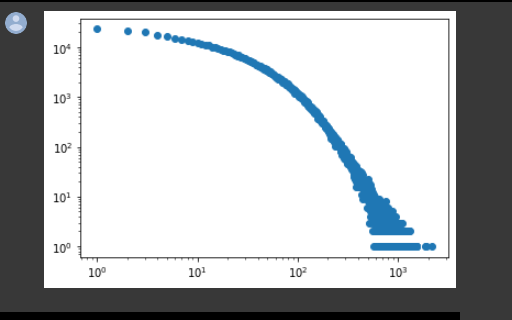

- Igual creo que hay que saber dos cosas más de #Python.
	- El orden de las importaciones. De mi COLAB de la tesis [(link)](https://github.com/ErickMMuniz/NetworkAnalysis_TwitterTrends), me di cuenta que ^^NO SE PUEDE IMPORTAN CONSTANTES^^
- Sobre la #tesis.
	- Hay una propiedad interesante sobre la distribuci'on de Wiebull
	- 
	  Esta imagen es sobre la dsitribuci'on de grado de la red de seguimiento mutuo.
	-